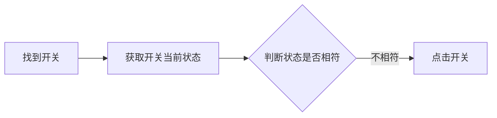

# 模拟开关输入

源文件 `element-form.js` 片段：

```javascript
const elSwitch = await elFormItems[3].$("div.el-switch");
// 判断 Switch 的现在状态
let switchStatus = await (
  await elSwitch.getProperty("ariaChecked")
).jsonValue();
if (switchStatus === null) {
  switchStatus = false;
}
if (switchStatus !== data.instant) {
  await elSwitch.click();
}
```

模拟流程：




## 相关 API

##### `elementHandle.getProperty(propertyName)`

- 功能描述：获取对应元素的某个属性。返回值是：`<Promise <JSHandle>>`。

> 属性名：在 HTML 页面中，属性名遵从“串式命名法”（kebab－case），即单词小写，并用 `-` 连接起来，例如：`aria-checked`。但是，在 javascript 引用属性名时，需将其转换为“驼峰命名法”（camelCase），例如：`ariaChecked`。


##### `jsHandle.jsonvalue()`

- 功能描述：返回对象的 JSON 值。

